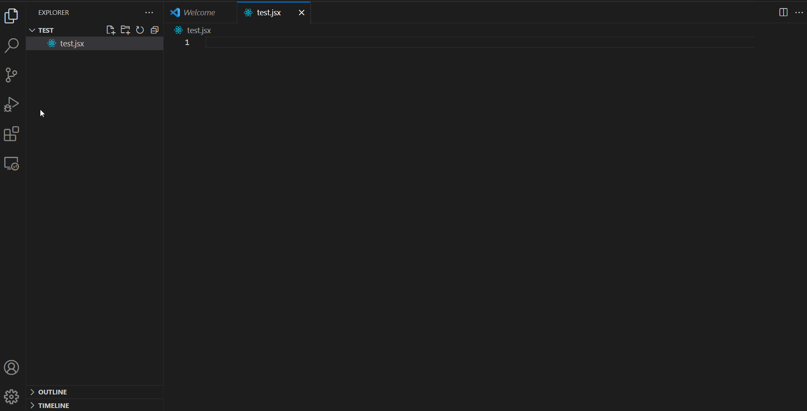

في هذا المنشور سنلقي نظرة خفيفة على `Extendscript` و هو أداة تستعمل مع برامج `Adobe` مثل التطبيق المشهور `Photoshop` الذي يعرفه عامة الناس. 
## ما هو `ExtendScript`؟
هو عبارة عن لغة برمجة مستوحاة من الإصدار القديم لـ `javascript` المدعو بـ `ES3` و التي تستعمل للتحكم في واجهة البرنامج بطريقة برمجية أي دون استعمال الفأرة أو لوحة المفاتيح.

أبسط شيء يمكننا فعله في أي لغة هي طباعة رسالة.



كما شاهدتم يجب علينا تثبيت إضافة ***ExtendScript Debugger*** أولا ثم الضغط على زر <kbd>F5</kbd> و اتباع الخطوات للحصول على رسالة في مساحة Debug Console.
```jsx
$.writeln("Hello, After effects!")
```

هذا هو أبسط شيء يمكننا بداية رحلتنا لتعلم الـ Extendscript به. سنتابع في المنشور القادم ان شاء الله.
