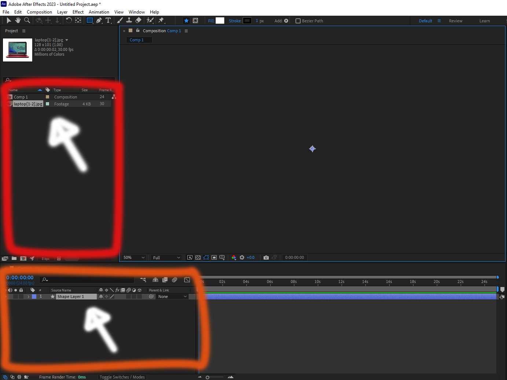

سنكمل حيث توقفنا أي في طباعة رسالة. دعونا نفعل شيئا مثيرا و نتواصل مع واجهة After Effects. كل ما عليك فعله هو انشاء تركيبة جديدة أي composition داخل البرنامج وإضافة صورة داخل لافتة المشروع وكذلك اضافة شكل من الأشكال داخل الجدول الخاص بالتركيبة.



سنبدأ بمحاولة الحصول على أسماء كل من الصورة و الطبقة التي قمنا بانشائها

```js
var comp = app.project.activeItem; // هكذا نصل الى التركيبة
var layers = comp.layers; // هكذا نصل الى جميع الطبقات
var layer = layes[0]; // هكذا نصل الى الطبقة الأولى
$.writeln(layer.name); // كتابة اسم الطبقة الأولى "Shape Layer 1"
```

الأن سنفعل نفس الشيء بالنسبة للصورة
```js
var projItems = app.project.items; // هكذا نصل الى عناصر المشروع
var item = projItems[0]; // هكذا نصل الى العنصر الأول
$.writeln(item.name); // laptopاسم العنصر الأول [1-2]
```

بعد هذه الأمثلة البسيطة التي تتعلق بالواجهة سنقوم بمراجعة 

